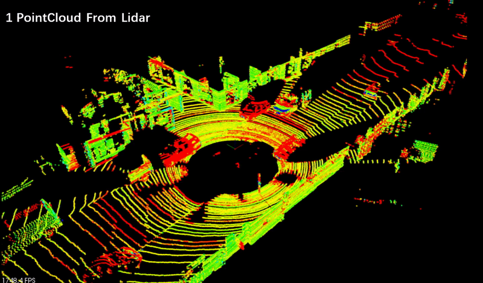
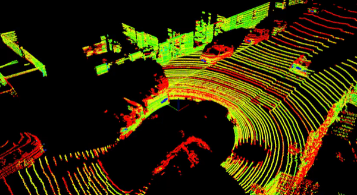
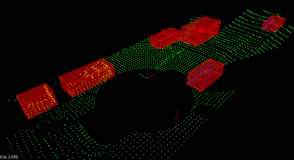
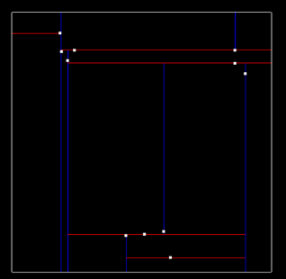
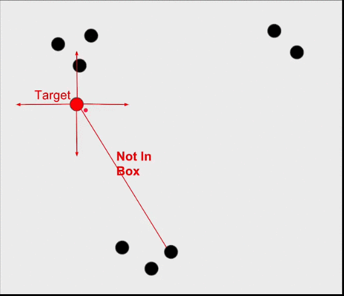
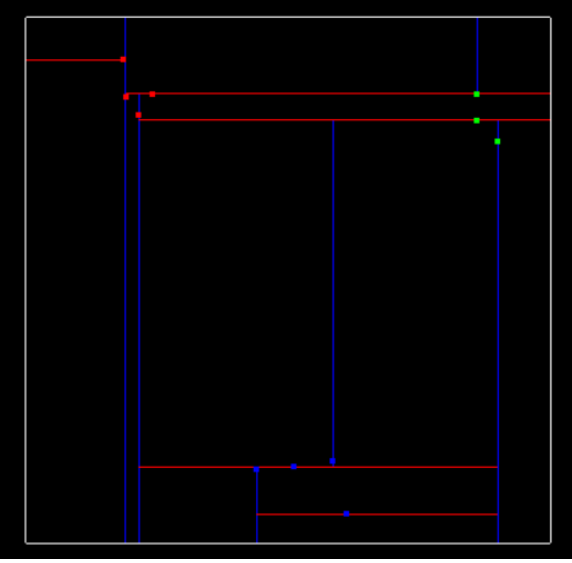

# Lidar Obstacle Detection

## Lidar

Lidar sensing gives us high resolution data by sending out thousands of laser signals. These lasers bounce off objects, returning to the sensor where we can then determine how far away objects are by timing how long it takes for the signal to return. Also we can tell a little bit about the object that was hit by measuring the intensity of the returned signal. Each laser ray is in the infrared spectrum, and is sent out at many different angles, usually in a 360 degree range. Lidar sensors gives us very high accurate models for the world around us in 3D.

## Steps Dealing with PCD Data

 <div align=center></div>

## Stream PCD

<table style="width:100%">
  <tr>
    <th>
      <p align="center">
       
      </p>
    </th>
    <th>
      <p align="center">
       
      </p>
    </th>
  </tr>
  </table>

## RANSAC for Segment

RANSAC stands for Random Sample Consensus, and is a method for detecting outliers in data. RANSAC runs for a max number of iterations, and returns the model with the best fit. Each iteration randomly picks a subsample of the data and fits a model through it, such as a line or a plane. Then the iteration with the highest number of inliers or the lowest noise is used as the best model.

<div align=center></div>

One type of RANSAC version selects the smallest possible subset of points to fit. For a line, that would be two points, and for a plane three points. Then the number of inliers are counted, by iterating through every remaining point and calculating its distance to the model. The points that are within a certain distance to the model are counted as inliers. The iteration that has the highest number of inliers is then the best model.

Other methods of RANSAC could sample some percentage of the model points, for example 20% of the total points, and then fit a line to that. Then the error of that line is calculated, and the iteration with the lowest error is the best model. This method might have some advantages since not every point at each iteration needs to be considered. It’s good to experiment with different approaches and time results to see what works best.

## KDTree for Euclidean Clustering

A KD-Tree is a binary tree that splits points between alternating axes. By separating space by splitting regions, nearest neighbor search can be made much faster when using an algorithm like Euclidean clustering. 

**Inserting Points into KD-Tree(two dimensions):**

* First Inserted point becomes root of the tree.

* Consecutive points will flow left if less than root x, or right if greater.

* Since we previously split in the x-dimension, the root was at depth 0, and split the x region. The next point became the left child of root and had a depth of 1, and split the y region. 

* A point at depth 2 will split the x region again, so the split dimension number can actually be calculated as depth % d, where d is the number of dimensions we are working with. 

* The basic idea is that the tree is traversed until the Node it arrives at is NULL, in which case a new Node is created and replaces the NULL Node.

<p align="center">
           <a></a>
           <b>Tree sepparating x and y region
      </p>
	
**Searching Points in a KD-Tree:**

The naïve approach of finding nearby neighbors is to go through every single point in the tree and compare their distances with the target, selecting point indices that fall within the distance tolerance of the target. Instead with the KD-Tree you can compare distance within a boxed square that is 2 x `distanceTol` for length, centered around the target point. If the current node point is within this box then you can directly calculate the distance and see if the point id should be added to the list of nearby ids. Then you see if your box crosses over the node division region and if it does compare that next node. You do this recursively, with the advantage being that if the box region is not inside some division region you completely skip that branch.

<p align="center">
           <a></a>
           <br>Tree searching x and y region
      </p>

**Euclidean Clustering:**

Once the KD-Tree method for searching for nearby points is implemented, its not difficult to implement a Euclidean clustering method that groups individual cluster indices based on their proximity.

<p align="center">
           <a></a>
           <br>Each of the three nearby clusters is colored differently, red, blue and green
      </p>

## Bounding Boxes

After clustering the points, I add bounding boxes around the clusters. The bounding box volume could also be thought of as space the car is not allowed to enter, or it would result in a collision.

Some comments from the previous concept about the way bounding boxes are calculated. That method of generating bounding boxes the boxes are always oriented along the X and Y axis. This is ok if the cluster that you are looking at has its majority of points orientated along these axes , but what if the cluster was a very long rectangular object at a 45 degree angle to the X axis. The solution in the post uses [PCA](https://en.wikipedia.org/wiki/Principal_component_analysis), principal component analysis and includes Z axis rotations as well. 

## Installation

### Ubuntu 

```bash
$> sudo apt install libpcl-dev
$> cd ~
$> git clone https://github.com/udacity/SFND_Lidar_Obstacle_Detection.git
$> cd SFND_Lidar_Obstacle_Detection
$> mkdir build && cd build
$> cmake ..
$> make
$> ./environment
```

### Windows 

http://www.pointclouds.org/downloads/windows.html

### MAC

#### Install via Homebrew
1. install [homebrew](https://brew.sh/)
2. update homebrew 
	```bash
	$> brew update
	```
3. add  homebrew science [tap](https://docs.brew.sh/Taps) 
	```bash
	$> brew tap brewsci/science
	```
4. view pcl install options
	```bash
	$> brew options pcl
	```
5. install PCL 
	```bash
	$> brew install pcl
	```

#### Prebuilt Binaries via Universal Installer
http://www.pointclouds.org/downloads/macosx.html  
NOTE: very old version 

#### Build from Source

[PCL Source Github](https://github.com/PointCloudLibrary/pcl)

[PCL Mac Compilation Docs](http://www.pointclouds.org/documentation/tutorials/compiling_pcl_macosx.php)
